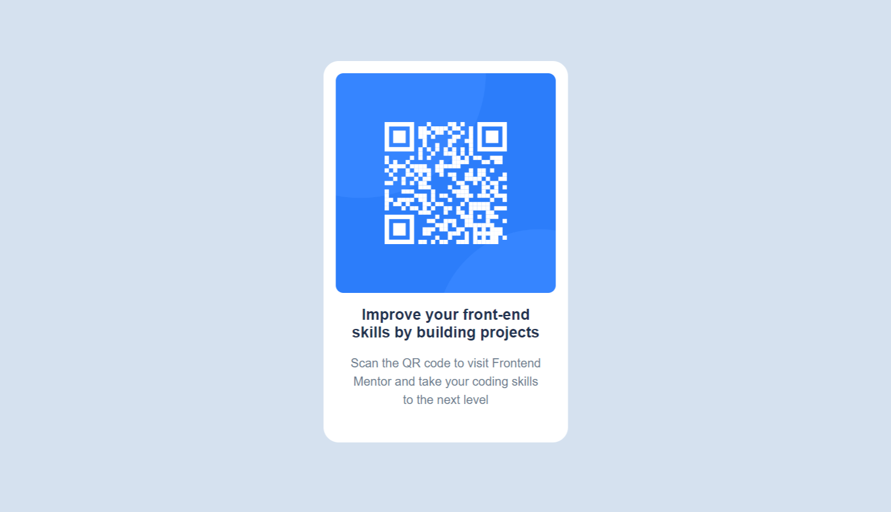

# Frontend Mentor - QR code component solution

This is a solution to the [QR code component challenge on Frontend Mentor](https://www.frontendmentor.io/challenges/qr-code-component-iux_sIO_H). Frontend Mentor challenges help you improve your coding skills by building realistic projects. 

## Table of contents

- [Overview](#overview)
  - [Screenshot](#screenshot)
  - [Links](#links)
- [My process](#my-process)
  - [Built with](#built-with)
  - [What I learned](#what-i-learned)
  - [Continued development](#continued-development)

- [Author](#author)

## Overview

### Screenshot

### Links

- Live Site URL: [QR component](https://alfonsovidrio.github.io/QR-component/)

## My process

### Built with

- Semantic HTML5
- CSS
- Flexbox

### What I learned

**Design with Flexbox:** I learned how to use Flexbox to simplify the process of aligning and distributing elements within a container, making the design more fluid and flexible.

### Continued Development

In future projects, I plan to focus on the following areas to further enhance my skills:

- **Learning CSS Grid:** I would like to deepen my understanding of CSS Grid to create more complex and adaptable layouts. Grid offers powerful features for building two-dimensional layouts and can complement my existing knowledge of Flexbox.

- **Further Practicing Flexbox:** While I have gained experience with Flexbox, I aim to continue practicing and mastering its advanced features to improve my ability to design flexible and responsive layouts.

- **Exploring New CSS Properties:** I am interested in learning and applying new CSS properties and techniques to enhance the visual appeal and functionality of my designs.

## Author

- Frontend Mentor - [Alfonso Vidrio](https://www.frontendmentor.io/profile/AlfonsoVidrio)
- LinkedIn - [Alfonso Manuel Vidrio Lizaolaa](https://www.linkedin.com/in/alfonsomanuelvidriolizaola/)

